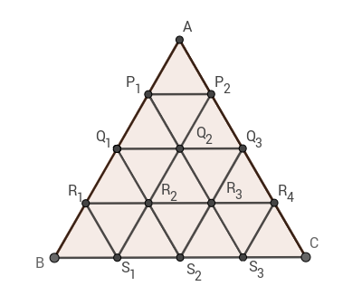

# D-Triangle Count

You are given an equilateral triangle ΔABC with the side BC being the base. Each side of the triangle is of length L. There are L-1 additional points on each of the sides dividing the sides into equal parts of unit lengths. Points on the sides of the triangle are called major points. Joining these points with lines parallel to the sides of ΔABC will produce some more equilateral triangles. The intersection points of these parallel lines are called minor points.

Look at the picture below. It contains

- Major points: A, B, C, P1, P2, Q1, Q3, R1, R4, S1, S2, S3 (note that we consider A, B, C as major points as well)
- Minor points: Q2, R2, R3
- Equilateral triangles ΔP1Q1Q2, ΔQ2S1S3, etc



We consider an equilateral triangle to be valid if

- Each of its vertices is either a major or a minor point, and
- The distance from its base (the base of a triangle is the side parallel to BC) to BC is less than the distance from the other vertex of the triangle (i.e. opposite vertex that doesn't lie on the base of triangle) to BC.

In the figure above, ΔQ2P1P2 is not a valid triangle but ΔQ2R2R3 is a valid triangle.

You will be given L, the length of the original triangle ΔABC. You need to find out the number of valid equilateral triangles with side length exactly K.

## Input

- The first line of the input contains an integer T denoting the number of test cases. The description of each testcase follows.
- Each test case has one line containing two space-separated integers: L and K.

## Output

For each testcase, print "Case i: ", and then the answer, where i is the testcase number, 1-indexed.

## Example Input

```
2
4 3
4 4
```

## Example Output

```
Case 1: 3
Case 2: 1
```
