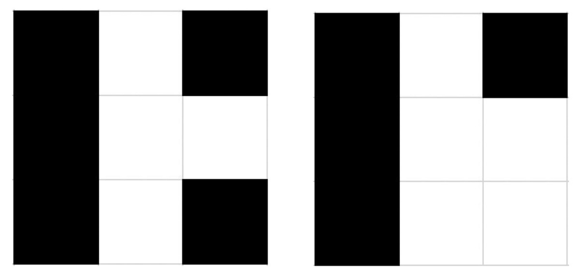

# Little Artem

Young boy Artem tries to paint a picture, and he asks his mother Medina to help him. Medina is very busy, that's why she asked for your help.

Artem wants to paint an 𝑛×𝑚 board. Each cell of the board should be colored in white or black.

Lets 𝐵 be the number of black cells that have at least one white neighbor adjacent by the side. Let 𝑊 be the number of white cells that have at least one black neighbor adjacent by the side. A coloring is called good if 𝐵=𝑊+1.



The first coloring shown below has 𝐵=5 and 𝑊=4 (all cells have at least one neighbor with the opposite color). However, the second coloring is not good as it has 𝐵=4, 𝑊=4 (only the bottom right cell doesn't have a neighbor with the opposite color).

Please, help Medina to find any good coloring. It's guaranteed that under given constraints the solution always exists. If there are several solutions, output any of them.

## Input

- Each test contains multiple test cases.

- The first line contains the number of test cases 𝑡 (1≤𝑡≤20). Each of the next 𝑡 lines contains two integers 𝑛,𝑚 (2≤𝑛,𝑚≤100) — the number of rows and the number of columns in the grid.

## Output

For each test case print 𝑛 lines, each of length 𝑚, where 𝑖-th line is the 𝑖-th row of your colored matrix (cell labeled with 'B' means that the cell is black, and 'W' means white). Do not use quotes.

## Example Input

```
2
3 2
3 3
```

## Example Output

```
BW
WB
BB
BWB
BWW
BWB
```
